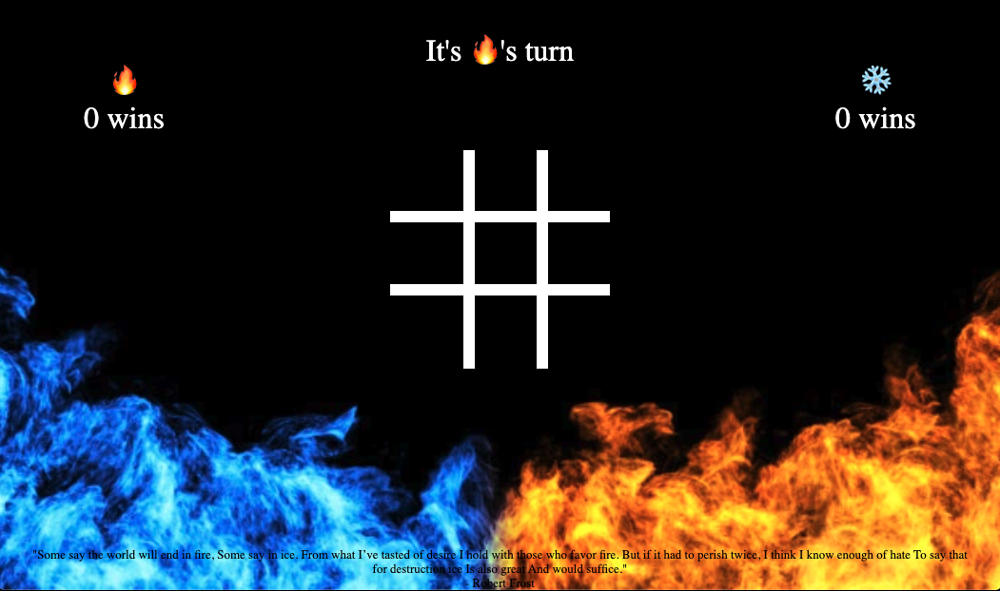

# Tic-Tac-Toe
> A [Front-End Project](https://github.com/lbmerchant93/tic-tac-toe) by [Lucas Merchant](https://github.com/lbmerchant93)
> * Project Manager [Kayla Wood ](https://github.com/kaylaewood)

## Overview
This is the final project for the 2010 Front End Cohort, which is used to show an understanding of the concepts discussed in Module 1. The objective of the project was to create an application that allows two users to play the age old game of Tic-Tac-Toe. Students must use their knowledge of HTML, CSS, and JavaScript to display a functioning game and design that shows which player's and the number of wins each player has. The number of wins should persist across a page reload.

### Project Goals

Below are the learning goals taken from the project specs.

``` Markdown
- Solidify and demonstrate understanding of:
  - DRY JavaScript
  - localStorage to persist data
  - event delegation to handle similar event listeners
- Understand the difference between the data model and how the data is displayed on the DOM
- Iterate through/filter DOM elements using for loops
- Use your problem solving process to break down large problems, solve things step by step, and trust yourself to not rely on an outside "answer" to a logical challenge
```

## Prerequisites

None. This project was developed on macOS Catalina 10.15.6 and tested in Chrome browsers (Version 85.0.4183.83), but does not require users to install any software or further functionality.

## Technologies

- HTML
- CSS
- JavaScript
- JSON (data interchange format)
- Git
- Github

## Features

+ [Desktop Layout](#desktop-layout)
+ [Game Play](#game-play)
+ [Game Reset](#game-reset)
+ [Number of Wins](#number-of-wins)

### Desktop Layout

When initially loaded, the page will display the Tic-Tac-Toe game board grid and that each player has zero wins. The left is player one (🔥) and the right is player two (❄️). The display message in the middle will show which player's turn it is and, when the time comes, display if the game has a winner or if it is a draw. On page load, the game will instantiate a new game which will default to player one being the first to go.



### Game Play

There are no extra steps to take in order to start the game, because the game is instantiated every time the page is loaded. The object of the game is to create a straight line with your token before your opponent. This line can be horizontal, vertical or diagonal. Once a player selects a box, this box is disabled and can not be changed. Players can see which boxes are free if the box is currently empty or noticing the cursor changes to a pointer when it is free to be chosen. Once a player is has met the winning conditions or the game board is filled completely the game will reset, see the section [Game Reset](#game-reset).


### Game Reset

Once players have made five moves collectively, the JavaScript will start to compare the inputs to possible winning conditions. If the player makes a winning move, the clickability for the whole game board is disabled. A winning display message is shown saying which player has won the game. A timeout function is run which will reset the game board to empty and add clickability back to each box. This timeout function will show the board for one second before resetting the game. The loser of the previous game will be the person that gets to start the next game. Once the players have selected all the boxes, the conditions for a possible winner will be checked first. If there is no winner, the display message will state that it is a draw and the timeout function will be run to start a new game. The opposite player will start the next game in the case of a draw. A game reset is not a page refresh or load.


### Number of Wins

In the event that a player meets the winning conditions, the game will add one win to their win count. The screen will update displaying that this player has a win count increase of one. The game will also save this update to the computer's local storage. Now that a player has a win in local storage, if the page were to be refreshed, the number of wins each player has will persist on the page. (If page is reloaded the game will default back to player one starting again.)

## Challenges

+ Being sure to keep the data models and DOM separate.
+ Getting the win conditions to not be a long function(tried but was unable complete this).

## Wins

+ Designing a comp that is personalized to me. Using an image as the background specifically.
+ Completing the functionality of the game itself, so that it can be played.

>[Back to Top](#tic-tac-toe)
